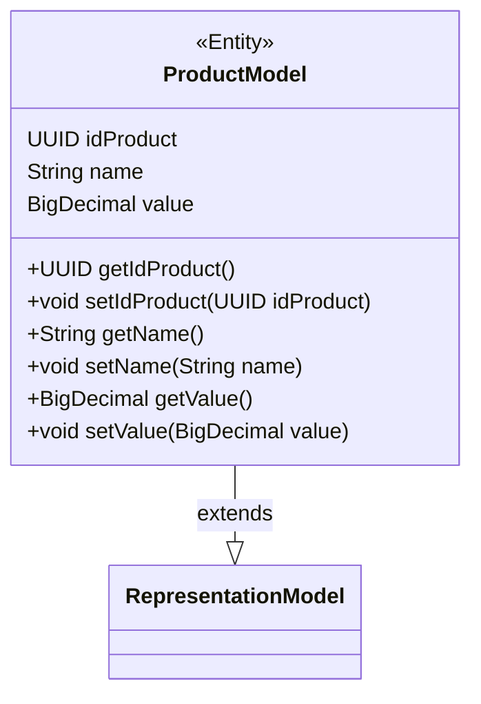

## Funcionalidades
- Salvar um produto
- Obter dados de um produto específico
- Obter todos os produtos
- Atualizar dados de um produto
- Deletar produto

## Endpoints
| Método HTTP | URL               | Descrição                           |
|-------------|-------------------|-------------------------------------|
| POST        | /products         | Cria um novo produto                |
| GET         | /products         | Retorna a lista de todos os produtos|
| GET         | /products/{id}    | Retorna os detalhes de um produto específico|
| PUT         | /products/{id}    | Atualiza um produto existente       |
| DELETE      | /products/{id}    | Deleta um produto específico        |

## Tecnologias utilizadas
- Spring Boot 3
- Postgres
- pgAdmin

## Video Aula 

[Spring Boot 3 com Michelli Brito  - 2023](https://youtu.be/wlYvA2b1BWI?si=4qY2B-TOXhcyywrQ)

## Skeleton das pastas do Projeto

```
├───.mvn
│   └───wrapper
├───src
│   ├───main
│   │   ├───java
│   │   │   └───com
│   │   │       └───example
│   │   │           └───shopping
│   │   │               ├───controllers
│   │   │               ├───dtos
│   │   │               ├───models
│   │   │               └───repositories
│   │   └───resources
│   └───test
│       └───java
│           └───com
│               └───example
│                   └───shopping
└───target
```
